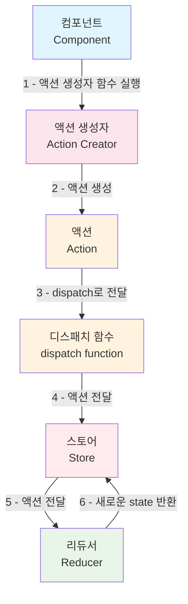

```mermaid
graph TD
    A[컴포넌트<br/>Component] -->|1 - 액션 생성자 함수 실행| G[액션 생성자<br/>Action Creator]
    G -->|2 - 액션 생성| H[액션<br/>Action]
    H -->|3 - dispatch로 전달| B[디스패치 함수<br/>dispatch function]
    B -->|4 - 액션 전달| C[스토어<br/>Store]
    C -->|5 - 액션 전달| D[리듀서<br/>Reducer]
    D -->|6 - 새로운 state 반환| C

    style A fill:#e1f5fe
    style B fill:#fff3e0
    style C fill:#ffebee
    style D fill:#e8f5e8
    style G fill:#fce4ec
    style H fill:#fff3e0

```